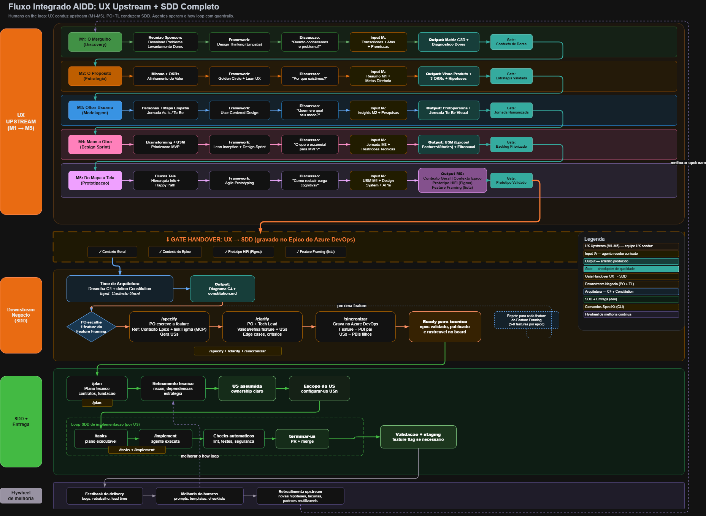

<div align="center">
  

  <h1>MRV AIDD Platform</h1>

  <h3>Documentação oficial, catálogo de extensions e presets, e base operacional da jornada MRV AIDD.</h3>

  <p>
    <a href="https://github.com/SavioMacedoMRV/mrv-aidd-platformc/releases/latest"></a>
    <a href="./LICENSE"></a>
    <a href="https://github.com/github/spec-kit/releases"></a>
    
  </p>
</div>

---

## Índice

- [🤔 O que é AIDD?](#-o-que-é-aidd)
- [🧭 Referências do AIDD](#-referências-do-aidd)
- [🔄 Fluxo de Trabalho MRV AIDD](#-fluxo-de-trabalho-mrv-aidd)
- [👥 Personas e Responsabilidades](#-personas-e-responsabilidades)
- [🚦 Gates e Artefatos](#-gates-e-artefatos)
- [📚 Core Philosophy](#-core-philosophy)
- [🎯 Objetivos](#-objetivos)
- [⚡ Get Started](#-get-started)
- [🧩 Spec Kit e os Pacotes MRV](#-spec-kit-e-os-pacotes-mrv)
- [📦 Catálogo de Extensions](#-catálogo-de-extensions)
- [🎨 Catálogo de Presets](#-catálogo-de-presets)
- [⌨️ Comandos Disponíveis](#️-comandos-disponíveis)
- [🗺️ Mapa da Documentação](#️-mapa-da-documentação)
- [🤝 Como Contribuir](#-como-contribuir)
- [📄 Licença](#-licença)

---

## 🤔 O que é AIDD?

**AIDD** é a estratégia de **AI Driven Development** da MRV — usar inteligência artificial para reduzir gaps, sanar problemas e trazer efetividade ao fluxo de desenvolvimento, mantendo **humans in the loop** o tempo inteiro.

A hierarquia conceitual da plataforma é esta:

| Camada                | O que é                                                                                                      |
| --------------------- | ------------------------------------------------------------------------------------------------------------ |
| **AIDD**              | Estratégia maior da MRV de inserir IA em toda a jornada de desenvolvimento                                   |
| **BDD + SDD**         | Jornada operacional que transforma a estratégia em entrega: discovery, clarificação, planejamento e execução |
| **Spec Kit**          | Um dos toolkits usados na camada SDD, com CLI, comandos core e mecanismo de extensions e presets             |
| **MRV AIDD Platform** | Camada da MRV que operacionaliza tudo isso: documentação oficial, catálogo versionado e pacotes instaláveis  |

O ponto central desta plataforma não é substituir pessoas por agentes. O modelo assume que **pessoas definem objetivo, restrições, qualidade, ownership e gates** — agentes operam o _how loop_ com guardrails.

Para a definição operacional completa do fluxo, veja [docs/aidd/README.md](./docs/aidd/README.md).

---

## 🧭 Referências do AIDD

### MRV AIDD Platform

Este repositório é a camada operacional compartilhada mantida pela MRV. Ele existe para centralizar o que é compartilhado entre times: o modelo operacional do fluxo, a documentação canônica e os pacotes instaláveis que estendem ou customizam o Spec Kit. Não é um repositório consumidor nem uma aplicação de negócio.

### BDD — Behavior-Driven Development

O BDD é usado para amadurecer comportamentos, bordas de escopo e validação de negócio antes da execução. Ele garante que as histórias de usuário sejam testáveis de forma independente e que os critérios de aceite estejam explícitos antes de qualquer planejamento técnico.

### SDD — Spec-Driven Development

O SDD organiza os artefatos que sustentam execução e rastreabilidade. Ele posiciona o `spec.md` como fonte de verdade funcional e o `plan.md` como fonte de verdade técnica, garantindo que a implementação seja sempre derivada de especificação validada — nunca de código ad hoc.

### Spec Kit

O Spec Kit é o toolkit open source do GitHub que fornece a CLI `specify`, comandos core de SDD e o mecanismo de extensions e presets. Esta plataforma consome o Spec Kit como base e adiciona, sobre ele, os pacotes MRV.

- Repositório: [github.com/github/spec-kit](https://github.com/github/spec-kit)
- Documentação: [github.github.io/spec-kit](https://github.github.io/spec-kit/)

---

## 🔄 Fluxo de Trabalho MRV AIDD



> **Diagrama editável**: [diagrama-aidd-integrado.drawio](./docs/aidd/diagrama-aidd-integrado.drawio) (abra no draw.io / VS Code)

O fluxo MRV AIDD não parte do código. Ele parte de discovery UX, clarificação, definição de artefatos e recorte de escopo.

| #   | Etapa                                                                                          | Quem         |
| --- | ---------------------------------------------------------------------------------------------- | ------------ |
| 1   | **Imersão no problema** — PO, UX, arquitetura e TL alinham o problema e o objetivo             | PO + TL      |
| 2   | **Mapeamento de features** — impacto, riscos, jornada e hipóteses ficam visíveis               | PO + UX      |
| 3   | **Protótipos UX** — fluxos, validações e fronteiras de escopo são amadurecidos                 | UX           |
| 4   | **Protótipo validado** — upstream fecha a referência funcional de entrada                      | Upstream     |
| 5   | **Feature framing** — objetivo, métricas, NFRs e dependências são consolidados                 | PO           |
| 6   | **Recebimento do downstream** — a feature chega como entrada principal do trabalho             | PO → Dev     |
| 7   | `/speckit.specify` + `/speckit.clarify` — PO indica a feature do Feature Framing, conduz entrevista progressiva com o agente e fecha gaps. Gera `spec.md` testável | Dev + Agente |
| 8   | **Publicação no board** — /sincronizar resolve o Épico, cria a Feature (se não existir) e grava USs como filhas | Dev + Agente |
| 9   | **Ready para técnico** — spec está validado, publicado e rastreável                            | TL           |
| 10  | `/speckit.plan` — TL fecha o recorte técnico e os contratos da feature                         | TL + Agente  |
| 11  | **Refinamento técnico** — devs e TL alinham riscos, dependências e estratégia                  | TL + Dev     |
| 12  | **Planning e readiness** — USs ficam prontas para assunção operacional                         | TL + Dev     |
| 13  | **US assumida** — dev ou par assume ownership explícito de uma US                              | Dev          |
| 14  | `/speckit.mrv-aidd-producao.configurar-us USn` — branch da US é preparada                      | Dev + Agente |
| 15  | `/speckit.tasks USn` — US é detalhada em tarefas acionáveis                                    | Agente       |
| 16  | `/speckit.implement USn` — agente implementa somente a US assumida                             | Agente       |
| 17  | `/speckit.mrv-aidd-producao.terminar-us USn` — entrega é validada, commitada e enviada para PR | Agente       |
| 18  | **Validação e merge** — branch da US retorna para a branch integradora da feature              | Dev + TL     |
| 19  | **Flywheel** — feedback do delivery volta para melhoria da plataforma e do backlog             | Time         |

Para detalhes de gates, critérios de passagem, paralelismo e hotfix, veja [docs/aidd/README.md](./docs/aidd/README.md).

---

## 👥 Personas e Responsabilidades

| Persona    | Entrada principal                    | Responsabilidade                                                                                    | Saída esperada                               |
| ---------- | ------------------------------------ | --------------------------------------------------------------------------------------------------- | -------------------------------------------- |
| **PO**     | Feature de upstream                  | Confirmar objetivo de negócio, gaps funcionais, bordas de escopo, prioridades e readiness funcional | Spec claro, validado e publicável            |
| **TL**     | Spec suficientemente clarificado     | Fechar o recorte técnico, contratos, fundação compartilhada, riscos e readiness de execução         | `plan.md`, estratégia e commitment           |
| **Dev**    | US assumida com ownership claro      | Executar o recorte certo, preservar rastreabilidade e validar a entrega                             | Branch da US, PR da US, checks verdes        |
| **Agente** | Spec, plan, tasks e escopo explícito | Operar o _how loop_ sem redefinir o problema nem expandir escopo indevidamente                      | Artefatos e alterações aderentes ao contexto |

---

## 🚦 Gates e Artefatos

### Gates de passagem

| Gate                              | O que garante                                                         |
| --------------------------------- | --------------------------------------------------------------------- |
| **Protótipo da feature validado** | Fecha a entrada de descoberta                                         |
| **Feature framing fechado**       | Consolida objetivo, métricas, NFRs e dependências antes do downstream |
| **Ready para técnico**            | Garante que o spec está validado, publicado e rastreável no board     |
| **Escopo explícito da US**        | Garante que o _how loop_ não opera com escopo solto                   |

### Artefatos oficiais

| Artefato                       | Papel no fluxo                       | Fonte de verdade               |
| ------------------------------ | ------------------------------------ | ------------------------------ |
| Feature de upstream            | Entrada de negócio                   | Upstream                       |
| `spec.md`                      | Verdade funcional consolidada        | Downstream (após clarificação) |
| Board                          | Espelho operacional: Épico → Feature → USs | Derivado do spec               |
| `plan.md`                      | Verdade técnica consolidada          | Planejamento técnico           |
| `tasks.md`                     | Detalhamento operacional da US       | Derivado do plan e do spec     |
| Branch `feature/<feature>/usN` | Isolamento operacional da US         | Execução                       |
| PR da US                       | Integração na branch da feature      | Execução                       |

---

## 📚 Core Philosophy

O AIDD desta plataforma se apoia em cinco princípios.

### Humans in the loop

Pessoas continuam definindo objetivo, restrições, ownership, qualidade e gates. Agentes operam o _how loop_ com guardrails. A plataforma não existe para remover pessoas do processo — existe para amplificar o que elas entregam.

### Spec before code

O fluxo não parte de implementação solta. Ele fecha o entendimento funcional antes de aprofundar o desenho técnico e antes de decompor o trabalho. A feature do upstream é entrada, nunca verdade final — ela passa por clarificação e validação antes de gerar qualquer artefato de execução.

### Source of truth explícita

- `spec.md` é a fonte de verdade funcional — somente depois de clarificação e validação
- `plan.md` é a fonte de verdade técnica
- O board espelha o `spec.md` validado — nunca o upstream bruto

### Execução por recorte

`/tasks` e `/implement` operam por US assumida e com escopo explícito. Sem isso, o agente tende a decompor ou implementar a feature inteira, o que é um risco operacional real.

### Melhoria contínua

O fluxo não termina em merge. Ele volta para o flywheel de melhoria: guardrails, harness, aprendizado operacional e backlog evoluem a cada ciclo.

---

## 🎯 Objetivos

Esta plataforma existe para perseguir objetivos claros:

- Reduzir ambiguidade entre feature recebida, spec validado, board e implementação
- Aumentar previsibilidade do fluxo com artefatos e gates bem definidos
- Manter rastreabilidade entre negócio, execução e entrega
- Dar um caminho instalável para uso de AIDD em repositórios reais de produção
- Separar com clareza capacidade nova de fluxo (`extension`) de customização de experiência (`preset`)
- Permitir evolução da plataforma sem acoplamento desnecessário a um único repositório consumidor

---

## ⚡ Get Started

Se você quer instalar e operar o fluxo o mais rápido possível, este é o caminho.

### 1. Inicialize o Spec Kit no repositório consumidor

```powershell
specify init . --ai copilot --script ps
specify check
```

### 2. Adicione os catálogos MRV

```powershell
specify extension catalog add https://raw.githubusercontent.com/SavioMacedoMRV/mrv-aidd-platformc/main/extensions/catalog.json --name mrv --install-allowed
specify preset catalog add https://raw.githubusercontent.com/SavioMacedoMRV/mrv-aidd-platformc/main/presets/catalog.json --name mrv --install-allowed
```

### 3. Instale a extension base e um preset

**Backend:**

```powershell
specify extension add mrv-aidd-producao
specify preset add mrv-aidd-producao-backend --priority 5
```

**Frontend:**

```powershell
specify extension add mrv-aidd-producao
specify preset add mrv-aidd-producao-frontend --priority 5
```

Instale apenas um preset por repositório consumidor.

### 4. Execute o fluxo operacional

```text
/speckit.specify
/speckit.clarify
/speckit.mrv-aidd-producao.sincronizar-us-devops
/speckit.plan
/speckit.mrv-aidd-producao.configurar-us USn
/speckit.tasks USn
/speckit.implement USn
/speckit.mrv-aidd-producao.terminar-us USn
```

O racional, os gates e os artefatos estão detalhados em [docs/aidd/README.md](./docs/aidd/README.md). O passo a passo de instalação está em [docs/guia-instalacao.md](./docs/guia-instalacao.md).

---

## 🧩 Spec Kit e os Pacotes MRV

O Spec Kit pode ser estendido e customizado por meio de dois mecanismos complementares: **extensions** e **presets**. Os pacotes desta plataforma usam ambos.

### Extensions — Adicionar Capacidades Novas

Use uma extension quando precisar de funcionalidade que vai além do core do Spec Kit: novos comandos, integração com ferramentas externas, hooks ou fluxos adicionais. Extensions _expandem_ o que o Spec Kit pode fazer.

```powershell
specify extension add <nome-da-extension>
```

### Presets — Customizar Comportamento Existente

Use um preset quando quiser mudar _como_ o Spec Kit opera sem adicionar capacidades novas. Presets sobrescrevem templates, comandos e linguagem — por exemplo, aplicando terminologia, ownership ou padrões organizacionais específicos. Presets _customizam_ os artefatos que o Spec Kit e suas extensions produzem.

```powershell
specify preset add <nome-do-preset> --priority 5
```

### Quando usar qual

| Necessidade                                                   | Use       |
| ------------------------------------------------------------- | --------- |
| Adicionar comando ou workflow novo                            | Extension |
| Customizar formato de spec, plan ou tasks                     | Preset    |
| Integrar com ferramenta ou serviço externo                    | Extension |
| Aplicar ownership, linguagem ou padrão organizacional         | Preset    |
| Adicionar hook de ciclo de vida                               | Extension |
| Adaptar terminologia ou templates para um contexto de negócio | Preset    |

Para mais detalhes sobre como criar e publicar pacotes, veja [docs/guia-contribuicao.md](./docs/guia-contribuicao.md).

---

## 📦 Catálogo de Extensions

O catálogo público de extensions desta plataforma está em [extensions/catalog.json](./extensions/catalog.json).

**URL pública:**

```
https://raw.githubusercontent.com/SavioMacedoMRV/mrv-aidd-platformc/main/extensions/catalog.json
```

| ID                  | Nome              | O que adiciona                                                                 | Comandos | Hooks |
| ------------------- | ----------------- | ------------------------------------------------------------------------------ | -------- | ----- |
| `mrv-aidd-producao` | MRV AIDD Produção | Sincronização com Azure DevOps, preparo de branch por US e encerramento com PR | 3        | 3     |

Para instalar:

```powershell
specify extension catalog add https://raw.githubusercontent.com/SavioMacedoMRV/mrv-aidd-platformc/main/extensions/catalog.json --name mrv --install-allowed
specify extension add mrv-aidd-producao
```

Veja mais em [extensions/mrv-aidd-producao/README.md](./extensions/mrv-aidd-producao/README.md).

---

## 🎨 Catálogo de Presets

O catálogo público de presets desta plataforma está em [presets/catalog.json](./presets/catalog.json).

**URL pública:**

```
https://raw.githubusercontent.com/SavioMacedoMRV/mrv-aidd-platformc/main/presets/catalog.json
```

| ID                           | Ownership principal | O que customiza                                                                            | Templates | Comandos |
| ---------------------------- | ------------------- | ------------------------------------------------------------------------------------------ | --------- | -------- |
| `mrv-aidd-producao-backend`  | Backend             | Templates, comandos e linguagem operacional para backend com rastreabilidade Azure DevOps  | 4         | 7        |
| `mrv-aidd-producao-frontend` | Frontend            | Templates, comandos e linguagem operacional para frontend com rastreabilidade Azure DevOps | 4         | 7        |

Para instalar:

```powershell
specify preset catalog add https://raw.githubusercontent.com/SavioMacedoMRV/mrv-aidd-platformc/main/presets/catalog.json --name mrv --install-allowed
specify preset add mrv-aidd-producao-backend --priority 5   # ou mrv-aidd-producao-frontend
```

Instale **apenas um preset** por repositório consumidor.

- [presets/mrv-aidd-producao-backend/README.md](./presets/mrv-aidd-producao-backend/README.md)
- [presets/mrv-aidd-producao-frontend/README.md](./presets/mrv-aidd-producao-frontend/README.md)

---

## ⌨️ Comandos Disponíveis

Após instalar a base do Spec Kit mais os pacotes MRV, os seguintes comandos ficam disponíveis no agente.

### Comandos core do Spec Kit

| Comando                  | O que faz                                                              |
| ------------------------ | ---------------------------------------------------------------------- |
| `/speckit.specify`       | Transforma a feature de upstream em `spec.md` testável                 |
| `/speckit.clarify`       | Clarifica ambiguidades do spec antes do planejamento técnico           |
| `/speckit.plan`          | Cria o `plan.md` com stack, contratos, riscos e estratégia de execução |
| `/speckit.tasks USn`     | Gera `tasks.md` com tarefas acionáveis para a US assumida              |
| `/speckit.implement USn` | Executa as tarefas da US assumida segundo o plan                       |
| `/speckit.checklist`     | Gera checklist de qualidade para validar completude e consistência     |
| `/speckit.analyze`       | Analisa consistência entre artefatos (spec, plan, tasks)               |

### Comandos da extension `mrv-aidd-producao`

| Comando                                            | O que faz                                                                           |
| -------------------------------------------------- | ----------------------------------------------------------------------------------- |
| `/speckit.mrv-aidd-producao.sincronizar-us-devops` | Resolve o Épico, cria a Feature como filha do Épico e sincroniza USs do spec como filhas da Feature no Azure DevOps |
| `/speckit.mrv-aidd-producao.configurar-us USn`     | Cria ou reutiliza a branch `feature/<feature>/usN` e prepara o contexto operacional |
| `/speckit.mrv-aidd-producao.terminar-us USn`       | Valida, commita, faz push e abre PR para a branch base da feature                   |

---

## 🗺️ Mapa da Documentação

| Para...                                               | Abra                                                                                           |
| ----------------------------------------------------- | ---------------------------------------------------------------------------------------------- |
| Entender o que é AIDD e o modelo operacional completo | [docs/aidd/README.md](./docs/aidd/README.md)                                                   |
| Instalar em um repositório consumidor (passo a passo) | [docs/guia-instalacao.md](./docs/guia-instalacao.md)                                           |
| Entender a extension operacional base                 | [extensions/mrv-aidd-producao/README.md](./extensions/mrv-aidd-producao/README.md)             |
| Escolher ou entender o preset backend                 | [presets/mrv-aidd-producao-backend/README.md](./presets/mrv-aidd-producao-backend/README.md)   |
| Escolher ou entender o preset frontend                | [presets/mrv-aidd-producao-frontend/README.md](./presets/mrv-aidd-producao-frontend/README.md) |
| Cenários de paralelismo e múltiplos devs              | [docs/aidd/colaboracao-e-paralelismo.md](./docs/aidd/colaboracao-e-paralelismo.md)             |
| Prompts operacionais por etapa do fluxo               | [docs/aidd/prompt-pack.md](./docs/aidd/prompt-pack.md)                                         |
| Modelos e convenções reutilizáveis de artefatos       | [docs/aidd/modelos-operacionais.md](./docs/aidd/modelos-operacionais.md)                       |
| Evoluir a plataforma com segurança                    | [docs/guia-contribuicao.md](./docs/guia-contribuicao.md)                                       |
| Publicar nova versão do catálogo                      | [docs/publicacao-catalogo.md](./docs/publicacao-catalogo.md)                                   |

---

## 🤝 Como Contribuir

O ponto de entrada para evoluir esta base é [docs/guia-contribuicao.md](./docs/guia-contribuicao.md).

Em resumo:

- Use `extension` para capacidades novas, hooks ou integrações — quando a mudança cria algo que não existe no core
- Use `preset` para ownership, linguagem, templates e comportamento de capacidades existentes — quando a mudança é de forma, não de função
- Mantenha manifesto, README, catálogo e comportamento real sempre coerentes
- Preserve os IDs públicos dos pacotes salvo quando houver motivo técnico claro e plano de migração documentado
- Preserve a hierarquia AIDD > BDD + SDD > Spec Kit > MRV AIDD Platform em toda documentação pública
- Documentação e textos operacionais em português do Brasil

---

## 📄 Licença

Este projeto é distribuído sob a licença MIT. Veja [LICENSE](./LICENSE).
