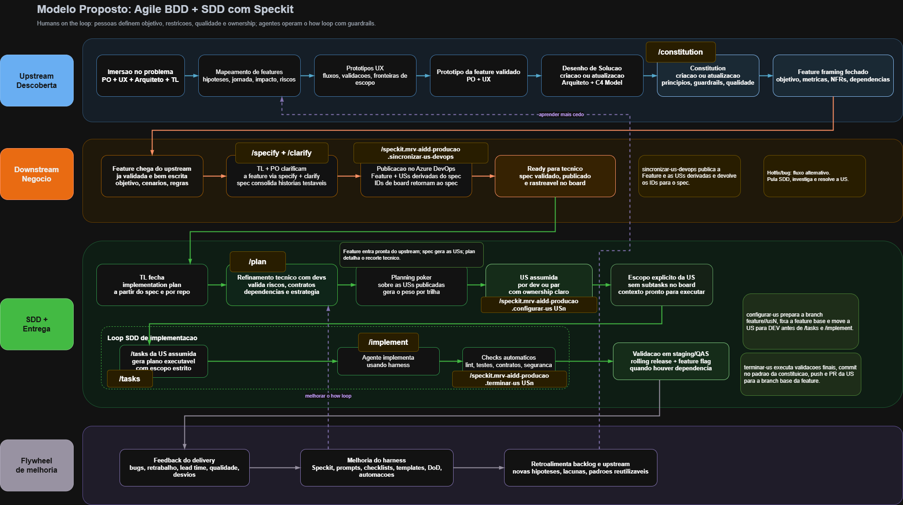

# AIDD: Modelo Operacional de Desenvolvimento

Este documento é a fonte de verdade textual do fluxo AIDD dentro do MRV AIDD Platform. Use-o para entender como o desenvolvimento realmente acontece quando a plataforma é usada em repositórios consumidores.

- Para a visão geral da plataforma, veja [../../README.md](../../README.md).
- Para instalar, veja [../guia-instalacao.md](../guia-instalacao.md).
- Para cenários de paralelismo, veja [colaboracao-e-paralelismo.md](./colaboracao-e-paralelismo.md).
- Para prompts operacionais, veja [prompt-pack.md](./prompt-pack.md).
- Para modelos e convenções de artefatos, veja [modelos-operacionais.md](./modelos-operacionais.md).

---

## Índice

- [Camadas do modelo](#camadas-do-modelo)
- [Referências do AIDD](#referências-do-aidd)
- [Core Philosophy](#core-philosophy)
- [O que o AIDD afirma](#o-que-o-aidd-afirma)
- [Personas e responsabilidades](#personas-e-responsabilidades)
- [Workflow ponta a ponta](#workflow-ponta-a-ponta)
- [Diagrama do fluxo](#diagrama-do-fluxo)
- [Gates oficiais](#gates-oficiais)
- [Artefatos oficiais](#artefatos-oficiais)
- [Critérios de passagem](#critérios-de-passagem)
- [Convenções operacionais](#convenções-operacionais)
- [Paralelismo real](#paralelismo-real)
- [Hotfix como exceção](#hotfix-como-exceção)
- [Anti-patterns](#anti-patterns)
- [Como usar este acervo](#como-usar-este-acervo)

---

## Camadas do modelo

Para evitar confusão conceitual, esta é a hierarquia oficial:

| Camada                | O que é                                                                                  |
| --------------------- | ---------------------------------------------------------------------------------------- |
| **AIDD**              | Estratégia maior de AI Driven Development da MRV                                         |
| **BDD + SDD**         | Jornada operacional que transforma a estratégia em entrega                               |
| **Spec Kit**          | Toolkit usado dentro da camada SDD                                                       |
| **MRV AIDD Platform** | Camada da MRV que instala documentação, convenções, extensions e presets sobre essa base |

Em termos práticos:

- a entrada de negócio chega como feature;
- a clarificação funcional consolida o `spec.md`;
- o desenho técnico consolida o `plan.md`;
- o board espelha o spec validado;
- a execução ocorre por US assumida, com escopo explícito.

---

## Referências do AIDD

Quando esta plataforma fala de AIDD, as referências conceituais são estas:

- **MRV AIDD Platform** — a camada operacional compartilhada mantida neste repositório.
- **BDD** — ajuda a amadurecer comportamentos, bordas de escopo e validação de negócio.
- **SDD** — organiza os artefatos que sustentam execução e rastreabilidade.
- **Spec Kit** — fornece CLI, comandos core e o mecanismo de extensions e presets.

Referências externas:

- Spec Kit repositório: [github.com/github/spec-kit](https://github.com/github/spec-kit)
- Spec Kit documentação: [github.github.io/spec-kit](https://github.github.io/spec-kit/)

---

## Core Philosophy

O AIDD desta plataforma se apoia em cinco princípios.

### Humans in the loop

Pessoas continuam definindo objetivo, restrições, ownership, qualidade e gates. Agentes operam o _how loop_ com guardrails.

### Spec before code

O fluxo não parte de implementação solta. Ele fecha o entendimento funcional antes de aprofundar o desenho técnico e antes de decompor o trabalho.

### Source of truth explícita

- A feature do upstream é entrada, não verdade final.
- `spec.md` vira a fonte de verdade funcional somente depois de clarificação e validação.
- `plan.md` vira a fonte de verdade técnica.
- O board deve espelhar o spec validado.

### Execução por recorte

`/tasks` e `/implement` operam por US assumida e com escopo explícito. Sem isso, o agente tende a decompor ou implementar a feature inteira, o que é um risco operacional.

### Melhoria contínua

O fluxo não termina em merge. Ele volta para o flywheel de melhoria, ajustando guardrails, harness, aprendizado operacional e backlog.

---

## O que o AIDD afirma

- A feature de upstream é a entrada principal do trabalho, mas pode chegar com gaps, ambiguidades ou omissões.
- O downstream não deve transcrever a feature cegamente. Ele deve clarificar o suficiente para tornar a feature testável e publicável.
- O board nunca deve ser a fonte funcional primária. Ele reflete o `spec.md` validado.
- O planejamento técnico não substitui a clarificação funcional. `plan.md` depende de um spec suficientemente fechado.
- Ownership backend e frontend vivem nas histórias, não como duplicação arbitrária da feature.
- Hotfix é exceção ao fluxo SDD normal, não o caminho principal.

---

## Personas e responsabilidades

| Persona    | Entrada principal                    | Responsabilidade                                                                                    | Saída esperada                               |
| ---------- | ------------------------------------ | --------------------------------------------------------------------------------------------------- | -------------------------------------------- |
| **PO**     | Feature de upstream                  | Confirmar objetivo de negócio, gaps funcionais, bordas de escopo, prioridades e readiness funcional | Spec claro, validado e publicável            |
| **TL**     | Spec suficientemente clarificado     | Fechar o recorte técnico, contratos, fundação compartilhada, riscos e readiness de execução         | `plan.md`, estratégia e commitment           |
| **Dev**    | US assumida com ownership claro      | Executar o recorte certo, preservar rastreabilidade e validar a entrega                             | Branch da US, PR da US, checks verdes        |
| **Agente** | Spec, plan, tasks e escopo explícito | Operar o _how loop_ sem redefinir o problema nem expandir escopo indevidamente                      | Artefatos e alterações aderentes ao contexto |

---

## Workflow ponta a ponta

1. **Imersão no problema** — PO, UX, arquitetura e TL alinham o problema e o objetivo.
2. **Mapeamento de features** — impacto, riscos, jornada e hipóteses ficam visíveis.
3. **Protótipos UX** — fluxos, validações e fronteiras de escopo são amadurecidos.
4. **Protótipo validado** — o upstream fecha a referência funcional de entrada.
5. **Feature framing** — objetivo, métricas, NFRs e dependências são consolidados.
6. **Recebimento do downstream** — a feature chega como entrada principal do trabalho.
7. `/speckit.specify` e `/speckit.clarify` — o downstream fecha gaps e transforma a entrada em `spec.md` testável.
8. **Publicação no board** — a feature e as USs derivadas do spec são sincronizadas e rastreadas.
9. **Ready para técnico** — o spec está validado, publicado e rastreável.
10. `/speckit.plan` — o TL fecha o recorte técnico e os contratos da feature.
11. **Refinamento técnico** — devs e TL alinham riscos, dependências e estratégia.
12. **Planning e readiness** — as USs ficam prontas para assunção operacional.
13. **US assumida** — um dev ou par assume ownership explícito de uma US.
14. `/speckit.mrv-aidd-producao.configurar-us USn` — a branch da US e o contexto operacional são preparados.
15. `/speckit.tasks USn` — a US é detalhada em tarefas acionáveis.
16. `/speckit.implement USn` — o agente implementa somente a US assumida.
17. `/speckit.mrv-aidd-producao.terminar-us USn` — a entrega é validada, commitada e enviada para PR.
18. **Validação e merge** — a branch da US retorna para a branch integradora da feature.
19. **Flywheel** — feedback do delivery e do processo volta para melhoria da plataforma e do backlog.

---

## Diagrama do fluxo

O diagrama abaixo representa visualmente as quatro macro-áreas do fluxo AIDD:

- **Upstream / Descoberta** — etapas 1 a 5
- **Downstream / Negócio** — etapas 6 a 9
- **SDD + Entrega** — etapas 10 a 18
- **Flywheel de melhoria** — etapa 19

A definição textual oficial do processo é esta página. O diagrama apoia a leitura, não substitui.

---

## Gates oficiais

| Gate                              | O que garante                                                         |
| --------------------------------- | --------------------------------------------------------------------- |
| **Protótipo da feature validado** | Fecha a entrada de descoberta                                         |
| **Feature framing fechado**       | Consolida objetivo, métricas, NFRs e dependências antes do downstream |
| **Ready para técnico**            | Garante que o spec está validado, publicado e rastreável no board     |
| **Escopo explícito da US**        | Garante que o _how loop_ não opera com escopo solto                   |

---

## Artefatos oficiais

| Artefato                       | Papel no fluxo                       | Fonte de verdade                           |
| ------------------------------ | ------------------------------------ | ------------------------------------------ |
| Feature de upstream            | Entrada de negócio                   | Upstream                                   |
| `spec.md`                      | Verdade funcional consolidada        | Downstream (após clarificação e validação) |
| Board                          | Espelho operacional do spec validado | Derivado do spec                           |
| `plan.md`                      | Verdade técnica consolidada          | Planejamento técnico                       |
| `tasks.md`                     | Detalhamento operacional da US       | Derivado do plan e do spec                 |
| Branch `feature/<feature>/usN` | Isolamento operacional da US         | Execução                                   |
| PR da US                       | Integração na branch da feature      | Execução                                   |
| Aprendizados de retro e ajuste | Feed do flywheel                     | Melhoria contínua                          |

---

## Critérios de passagem

### De feature para spec

- Os gaps funcionais relevantes foram fechados.
- Cada US pode ser testada de forma independente.
- Bordas de escopo e ownership estão explícitos.

### De spec para board

- O `spec.md` está validado.
- As histórias do board derivam do spec, não do upstream bruto.
- A rastreabilidade com Azure DevOps ou outro board está definida quando aplicável.

### De board para plan

- O board já espelha a feature e as USs publicadas.
- Não existe divergência funcional entre board e spec.
- A ordem de execução está coerente com o spec validado.

### De plan para execução

- `plan.md` identifica stack, contratos, fundação compartilhada, riscos e estratégia.
- Dependências entre USs estão visíveis.
- Ficou claro o que pode e o que não pode paralelizar.

### Para permitir `/tasks`

- Existe US assumida por um dev ou par.
- Existe escopo explícito da execução atual.
- O agente sabe qual US está em foco.

### Para permitir `/implement`

- A US em foco tem tarefas acionáveis.
- A branch da US existe ou será criada pelo fluxo da extension.
- O recorte técnico já está refletido no `plan.md`.
- Os checks mínimos foram combinados.

---

## Convenções operacionais

### Branches e PRs

- Branch integradora da feature: `001-nome-da-feature` ou equivalente do Spec Kit.
- Branch por US: `feature/<feature-branch>/usN`.
- PR de US mira a branch integradora da feature.
- PR final para `main` sai da branch integradora, não de uma branch de US.

### Board e rastreabilidade

- A feature do board representa a feature consolidada do `spec.md`.
- As USs do board derivam do spec validado.
- Quando necessário, o board projeta ownership FE e BE a partir do mesmo spec funcional.
- O ID do work item sincronizado volta para o próprio `spec.md`.

### Ownership

- Backend e frontend vivem como ownership de histórias.
- O repositório consumidor instala apenas o preset do próprio ownership.
- Handoff não significa duplicar a feature nem quebrar a fonte de verdade funcional.

---

## Paralelismo real

O AIDD suporta múltiplos devs em USs diferentes, desde que estas regras sejam respeitadas:

- `spec.md` continua único por feature.
- `plan.md` registra fundação compartilhada, riscos e contratos.
- Cada dev executa `/tasks` apenas para a US assumida.
- Cada dev executa `/implement` apenas para a US assumida.
- Se duas USs disputam a mesma fundação estrutural, o paralelismo não é seguro até o bloqueio ser removido.

Para detalhamento operacional de cenários complexos, veja [colaboracao-e-paralelismo.md](./colaboracao-e-paralelismo.md).

---

## Hotfix como exceção

Hotfix fica fora do fluxo SDD normal.

- Não depende de decompor a feature inteira em spec, plan e tasks por US.
- Deve ser tratado como exceção controlada, não como caminho padrão.
- Precisa registrar contexto, impacto, validação mínima e aprendizado para o flywheel.
- Quando expuser lacuna estrutural, a correção do processo deve voltar ao fluxo normal depois da urgência.

---

## Anti-patterns

- Reescrever a feature do upstream em vez de clarificar.
- Usar o board como fonte funcional primária.
- Rodar `/tasks` sem US assumida e sem escopo explícito.
- Deixar o agente decompor a feature inteira por falta de recorte.
- Misturar fundação compartilhada com várias USs sem registrar o desbloqueio.
- Abrir PR de uma US direto para `main`.
- Tratar hotfix como se fosse o caminho padrão.

---

## Como usar este acervo

| Para...                                          | Abra                                                           |
| ------------------------------------------------ | -------------------------------------------------------------- |
| Visão geral da plataforma                        | [../../README.md](../../README.md)                             |
| Instalar em repositório consumidor               | [../guia-instalacao.md](../guia-instalacao.md)                 |
| Exemplos e convenções reutilizáveis de artefatos | [modelos-operacionais.md](./modelos-operacionais.md)           |
| Cenários com múltiplos devs e trilhas separadas  | [colaboracao-e-paralelismo.md](./colaboracao-e-paralelismo.md) |
| Prompts operacionais por etapa                   | [prompt-pack.md](./prompt-pack.md)                             |
